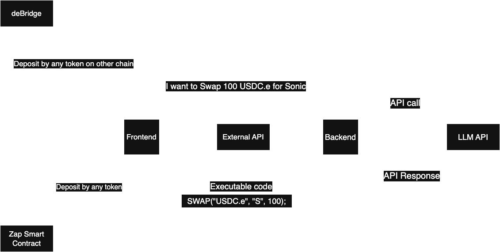
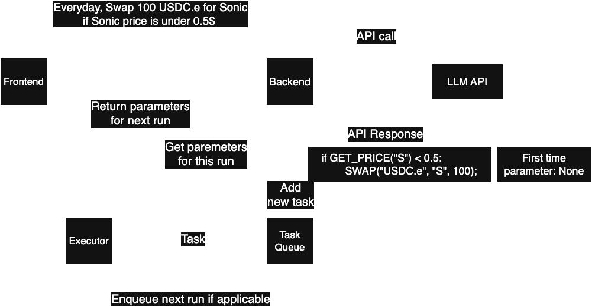

# DogBone – One-stop Sonic DeFAI

**Table of Contents**
- [DogBone – One-stop Sonic DeFAI](#dogbone--one-stop-sonic-defai)
  - [Overview](#overview)
  - [Why DogBone?](#why-dogbone)
  - [Core Problems in DeFi](#core-problems-in-defi)
  - [DogBone’s Solution](#dogbones-solution)
  - [Key Features](#key-features)
    - [Seamless Access \& Interaction](#seamless-access--interaction)
    - [Cross-Chain \& Yield Farming Optimization](#cross-chain--yield-farming-optimization)
    - [Smart Portfolio Tracking \& Recommendations](#smart-portfolio-tracking--recommendations)
    - [Automation \& Smart Execution](#automation--smart-execution)
  - [Architecture](#architecture)
  - [Sonic DeFi Landscape \& Market Outlook](#sonic-defi-landscape--market-outlook)
  - [Revenue Streams](#revenue-streams)
  - [Roadmap](#roadmap)
    - [**Q1 2025**](#q1-2025)
    - [**Q2 2025**](#q2-2025)
    - [**Q3 2025**](#q3-2025)
  - [Contact](#contact)

---

## Overview

**DogBone** is an all-in-one, AI-assisted DeFi gateway for the **Sonic** blockchain ecosystem. It is designed to drastically simplify user onboarding and interaction with DeFi (Decentralized Finance). By incorporating cutting-edge LLM (Large Language Model) technology and **account abstraction (ERC-4337)** principles, DogBone smooths out the complexities of yield farming, cross-chain interactions, and automated strategies.

**Mission**: Accelerate DeFi adoption on Sonic by delivering a user-focused experience, intelligent tooling, and a powerful automation layer that optimizes yield opportunities across multiple protocols.

---

## Why DogBone?

- **Unified Gateway to Sonic**: DogBone provides a one-stop hub where users can seamlessly explore yield-farming protocols, automate liquidity management, and interact with multiple cross-chain assets without juggling multiple interfaces.
- **AI-Powered Ease of Use**: Natural language queries and an AI-assisted dashboard guide new and experienced users alike, demystifying complex DeFi operations.
- **Deep Integration with Sonic**: Built to leverage Sonic’s growing ecosystem, DogBone integrates natively with Sonic-based protocols (e.g., Silo, Rings, Vicuna, Yel, etc.), ensuring frictionless connectivity.
- **Automation for Everyone**: From simple limit orders to complex “if-this-then-that” yield loops, DogBone harnesses an LLM-based engine to execute advanced strategies on behalf of users.

---

## Core Problems in DeFi

1. **High Barrier to Entry**  
   - Many new users are unfamiliar with Sonic or DeFi in general.  
   - Traditional private-key handling and token bridging present technical hurdles.

2. **Fragmented Liquidity & Opportunities**  
   - Multiple protocols and scattered yield strategies make it hard to track the best APR (Annual Percentage Rate).  
   - Users struggle to manage funds across different protocols and chains.

3. **Manual Effort & Complexity**  
   - DeFi often requires multiple transactions (e.g., bridging, swapping, staking).  
   - Optimizing yield strategies or reacting to market conditions is time-consuming and error-prone.

4. **Lack of Automation**  
   - Many DeFi features require manual intervention, limiting advanced strategies (e.g., limit orders, dynamic rebalancing).

---

## DogBone’s Solution

1. **Simplified UX & AI Assistance**  
   - A user can log in using **email** (no private keys required).  
   - AI-driven onboarding teaches DeFi basics and helps navigate strategies.

2. **All-in-One Platform**  
   - Leverages cross-chain zapping and bridging to minimize the number of transactions.  
   - Aggregates multiple Sonic protocols in a unified interface.

3. **Smart Execution & Yield Optimization**  
   - An LLM engine interprets natural language prompts (e.g., “Allocate 50% of my ETH from Base into the highest APY vault”).  
   - Automations and advanced strategies (arbitrage, limit orders, yield loops) are packaged into easy, one-click flows.

4. **Onboarding & User Growth**  
   - Lower friction for new DeFi participants.  
   - Educational resources and interactive AI bot to guide each step.

---

## Key Features

### Seamless Access & Interaction
- **Account Abstraction (ERC-4337)**: Users can register via email. Private key handling is abstracted, reducing friction for non-crypto natives.  
- **AI Assistance**: Both newcomers and DeFi veterans benefit from an **LLM-powered** interface that explains strategies and guides portfolio management.  
- **All-in-One**: Integrations with major yield-farming protocols on Sonic, removing the need to hop between different dApps.

### Cross-Chain & Yield Farming Optimization
- **One-Click Deposits (Zap + Bridge)**  
  - Users can deposit *any* token from *any* chain directly into a target strategy on Sonic.  
  - DeBridge hooks and DogBone’s custom Zap smart contract handle bridging, swapping, and depositing automatically.  
- **Custom Strategies**  
  - Yield looping, arbitrage strategies, multi-step transactions—DogBone’s AI orchestrates complex flows in one user action.  
- **LLM-Driven Execution**  
  - Users can type advanced commands like “Move my stablecoins to the highest APY vault every 72 hours,” and the system handles it.

### Smart Portfolio Tracking & Recommendations
- **Portfolio Dashboard**  
  - Monitor cross-protocol token flows, staked amounts.  
  - Real-time data on overall net worth and performance.  
- **Strategy Suggestions**  
  - Personalized recommendations based on holdings, risk appetite, and APY trends.  
  - Built-in AI detects new opportunities to maximize yield or reduce exposure.

### Automation & Smart Execution
- **Limit Orders**  
  - “Buy 100 SONIC if the price drops below $0.50.”  
  - Automated triggers execute in the background without constant monitoring.
- **Complex Conditional Strategies**  
  - E.g., “Every day, if SONIC price is below $0.50, use `(0.6 - SONIC price) * 100 USDC` to deposit into the highest APR Sonic Vault.”  
  - LLM can parse natural language instructions and translate them into on-chain actions.
- **Periodic Rebalancing**  
  - E.g., “Deposit 50% of my ETH into the safest strategy. Rebalance the other 50% to the highest APY every 3 days.”
- **And beyond...**
---

## Architecture

1. **LLM Backend**  
   - Processes user instructions and returns **executable JavaScript code**.  
   - High performance (“Sonic Speed”) allows for sophisticated prompts with minimal latency.  
   - Reduce LLM and Backend cost.

2. **DogBone Zap Smart Contract**  
   - **One-Transaction Zaps**: Bridges and swaps any token from any supported EVM chain to a Sonic-based strategy.  
   - **DeBridge HookData**: Minimizes the user’s involvement in bridging steps, abstracting away numerous intermediate transactions.

3. **Automation Flow**  
   - The same executable code from the LLM can be reused for periodic or event-based automations.  
   - “Set it and forget it” approach to implementing advanced DeFi logic (limit orders, daily or hourly rebalancing, multi-protocol investing, etc.).

By merging an **AI-driven** backend and a **powerful on-chain zap** solution, DogBone delivers a simplified yet robust experience for all levels of DeFi users.

---

## Sonic DeFi Landscape & Market Outlook

- **Sonic’s Rapid Growth**:  
  - Sonic TVL (Total Value Locked) is rising sharply, from \$26M in 01/2025 to \$652M in 03/2025.  
  - Cross-chain inflow from bridging solutions (e.g., DeBridge) is fueling continuous expansion.

- **Opportunity**:  
  - As more users discover Sonic, DogBone is positioned to be the *gateway* for novices and power users alike.  
  - Consolidating a fragmented ecosystem into one platform fosters user retention and repeat interactions.

---

## Revenue Streams

1. **Sonic FeeM**  
   - DogBone receives 90% of the network fees generated by the Zap smart contracts from Sonic Labs.

2. **Smart Contract Fee**  
   - A small surcharge on each Zap transaction to cover operational costs.

3. **AI Fee**  
   - Basic AI features are free (with rate limits). Advanced LLM queries and higher usage tiers may require a fee.

4. **Automation Fee**  
   - Creating, deploying, and running automated strategies involves a small on-chain or subscription-based fee structure.

---

## Roadmap

### **Q1 2025**
- **Mainnet Deployment**: Fully launch on Sonic mainnet.  
- **Zap Smart Contract Audit**: Complete a thorough security review.  
- **UI Finalization**: Deliver a polished user experience.  
- **Fiat On-Ramp**: Enable buying crypto with fiat, lowering onboarding friction.

### **Q2 2025**
- **Protocol Integrations**: Add more platforms (StableJack, Snake Finance, etc.).  
- **Extended Zap**: Cover liquidity pools (Equalizer, Shadow Exchange).  
- **Data Partnerships**: Formal APIs and robust data endpoints with partner protocols.  
- **Automation Features**: Complete support for automation.  
- **Smart Contract Audit**: Enhance security, conduct ongoing audits.  
- **Tokenomics Launch**: Introduce DogBone’s token model and incentives.

### **Q3 2025**
- **Permissionless Custom Strategies**: Any user/developer can create and deploy new automated strategies.  
- **Reduced Transaction Count**: Further combine steps into fewer on-chain calls.  
- **Advanced Automations**: Market-sentiment triggers, advanced “if-this-then-that” logic.  
- **Ongoing Enhancements**: Continuously refine LLM performance and user experience.

---

## Contact

- **Email**: [ai@dogbone.fi](mailto:ai@dogbone.fi)  
- **Twitter**: [@DogboneOnSonic](https://twitter.com/DogboneOnSonic) *(DogBone)*  

We’d love to hear your feedback, discuss potential partnerships, and welcome any contributions to the DogBone ecosystem. Whether you’re a developer looking to integrate or a user wanting to level up your DeFi experience, we’re here to help!

---

**Thank you for reading the DogBone README!** If you have any questions or want to contribute, please reach out via our contact channels. We look forward to growing the **Sonic DeFi** landscape with you.
